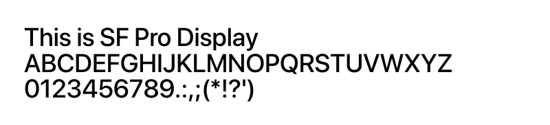
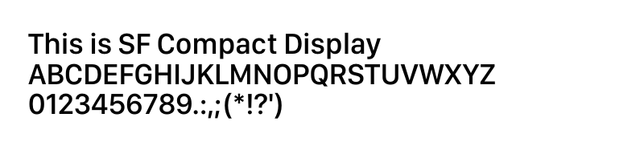
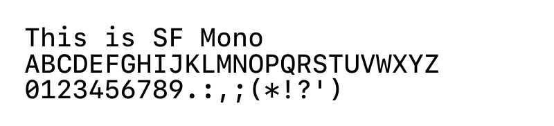
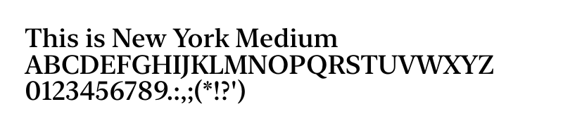

<div align="center">

</div>

<h1 align="center">Apple fonts for CSS</h1>
<div align="center">
Fonts designed by Apple in California.
<br>
Intended for personal / non-commercial use.

**https://developer.apple.com/fonts/**
</div>

<br>

<div align="center">
<table>
    <tr>
        <th>
            SF Pro
        </th>
        <th>
            SF Compact
        </th>
    </tr>
    <tr>
        <td>
            
        </td>
        <td>
            
        </td>
    </tr>
    <tr>
        <td>
            <b>Family names:</b>&nbsp;
            <code>SF Pro Display</code>,&nbsp;
            <code>SF Pro Rounded</code>,&nbsp;
            <code>SF Pro Text</code>
        </td>
        <td>
            <b>Family names:</b>&nbsp;
            <code>SF Compact Display</code>,&nbsp;
            <code>SF Compact Rounded</code>,&nbsp;
            <code>SF Compact Text</code>
        </td>
    </tr>
    <tr>
        <th>
            SF Mono
        </th>
        <th>
            New York
        </th>
    </tr>
    <tr>
        <td>
            
        </td>
        <td>
            
        </td>
    </tr>
    <tr>
        <td>
            <b>Family names:</b>&nbsp;
            <code>SF Mono</code>
        </td>
        <td>
            <b>Family names:</b>&nbsp;
            <code>New York Extra Large</code>,&nbsp;
            <code>New York Large</code>,&nbsp;
            <code>New York Medium</code>,&nbsp;
            <code>New York Small</code>
        </td>
    </tr>
</table>
</div>

<br>

Sourced from: https://github.com/mikage-961pro/Apple-Fonts 
<br>
Converter used: https://kombu.kanejaku.org/

<br>

###### CSS Import
```css
@import url("https://rawcdn.githack.com/yurifuko/AppleFontsCSS/63d11c4a50ce8ee001f70870bbe4f2752983848d/Apple-fonts.css");
```
###### HTML Stylesheet
```html
<link rel="stylesheet" href="https://rawcdn.githack.com/yurifuko/AppleFontsCSS/63d11c4a50ce8ee001f70870bbe4f2752983848d/Apple-fonts.css">
```
###### The raw CDN:
```
https://rawcdn.githack.com/yurifuko/AppleFontsCSS/63d11c4a50ce8ee001f70870bbe4f2752983848d/Apple-fonts.css
```
